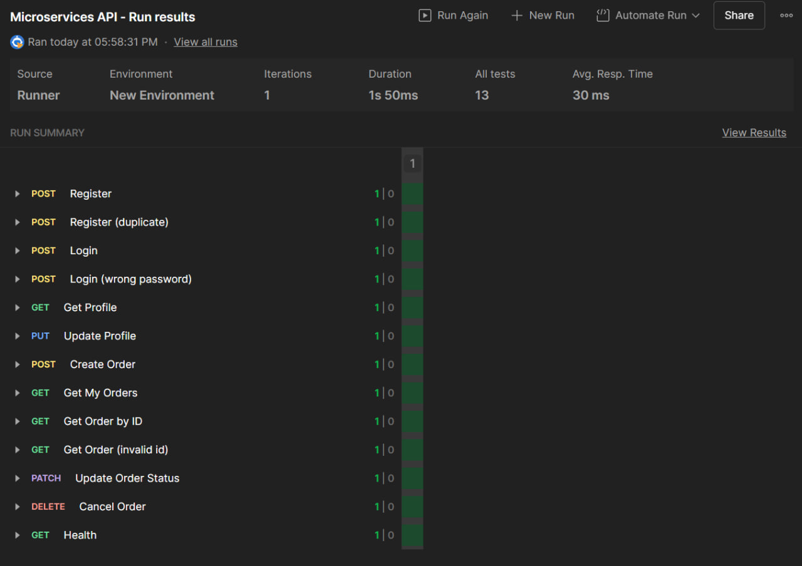

# Microservices Backend System


## Описание проекта

Микросервисная система, состоящая из трёх компонентов на Node.js с использованием Express, Prisma и PostgreSQL.

**Компоненты системы:**
- **API Gateway** — единая точка входа, маршрутизация, JWT-проверка, rate-limit и CORS.
- **Service Users** — регистрация, вход, профиль пользователя, список пользователей (для администратора).
- **Service Orders** — создание, обновление и получение заказов.
- **PostgreSQL** — основная база данных, используемая обоими сервисами.

Все сервисы упакованы в контейнеры Docker и управляются через `docker-compose.yml`.

---
## Запуск через Docker Compose

### Установка зависимостей

> Требуется установленный **Docker** и **Docker Compose**.

```
sudo docker compose up --build
```


После успешного запуска вы увидите:

```api_gateway listening on 3000```

```service-users listening on 4001```

```service-orders listening on 4002```

---
### Сервисы по портам:
- API Gateway	3000	(точка входа)
- Service Users	4001	(управление пользователями)
- Service Orders	4002	(работа с заказами)
- PostgreSQL	5432	(База данных)
---

### Авторизация

Используется Bearer Token (JWT).

Токен передаётся в заголовке Authorization.

Пример:

Authorization: Bearer <your_jwt_token>

### Основные маршруты
#### Пользователи
`POST	/api/users/register`	Регистрация

`POST	/api/users/login`	Авторизация (JWT)

`GET	/api/users/me`	Получение профиля

`PUT	/api/users/me`	Обновление профиля

`GET	/api/users`	Список пользователей (роль admin)

#### Заказы
`POST	/api/orders`	Создание заказа

`GET	/api/orders/:id`	Получение заказа

`GET	/api/orders`	Список заказов текущего пользователя

`PUT	/api/orders/:id/status`	Обновление статуса

`DELETE	/api/orders/:id`	Отмена заказа

---
### Тестирование

Подготовлена коллекция Postman в ./docs/postman_collection.json.

Все тесты успешно проходят:



---
### Три окружения (dev / test / prod)

Используются отдельные .env файлы:

.env.development — для локальной разработки

.env.test — для тестовой среды

.env.production — для продакшн запуска

Переключение окружений:

```
NODE_ENV=development
```


Docker Compose автоматически использует .env файлы из соответствующих сервисов.
Возможно задать уникальные значения переменных (например, разные базы данных или секреты JWT).

---
### Логирование и трассировка

Логи создаются через Pino.

Каждый запрос получает уникальный X-Request-ID, передаваемый между сервисами.

Все события (регистрация, заказы) логируются и могут быть трассированы через Gateway.

---
### Документация API
#### OpenAPI (Swagger)

Файл спецификации:
```./docs/openapi.yaml```

Для проверки и просмотра можно использовать один из вариантов:

Вариант 1 — через Swagger Editor онлайн:

Перейдите на https://editor.swagger.io/

Импортируйте файл docs/openapi.yaml

Вариант 2 — через CLI:
```
npx openapi-validator-cli validate ./docs/openapi.yaml
```

или через swagger-cli (если установлен):

```
npx swagger-cli validate ./docs/openapi.yaml
```

### Команды разработки
```
npm run dev	# Запуск в режиме разработки
```

```
npm run build	# Компиляция TypeScript
```

```
npm start # Запуск продакшн версии
```

```
npx prisma migrate dev	# Применить миграции Prisma
```

```
npx prisma studio	# Просмотр данных через веб-интерфейс
```

### Используемые технологии
Язык	TypeScript

Framework	Express.js

ORM	Prisma

Валидация	Zod

Аутентификация	JWT

Логирование	Pino

Контейнеризация	Docker + Compose

База данных	PostgreSQL
